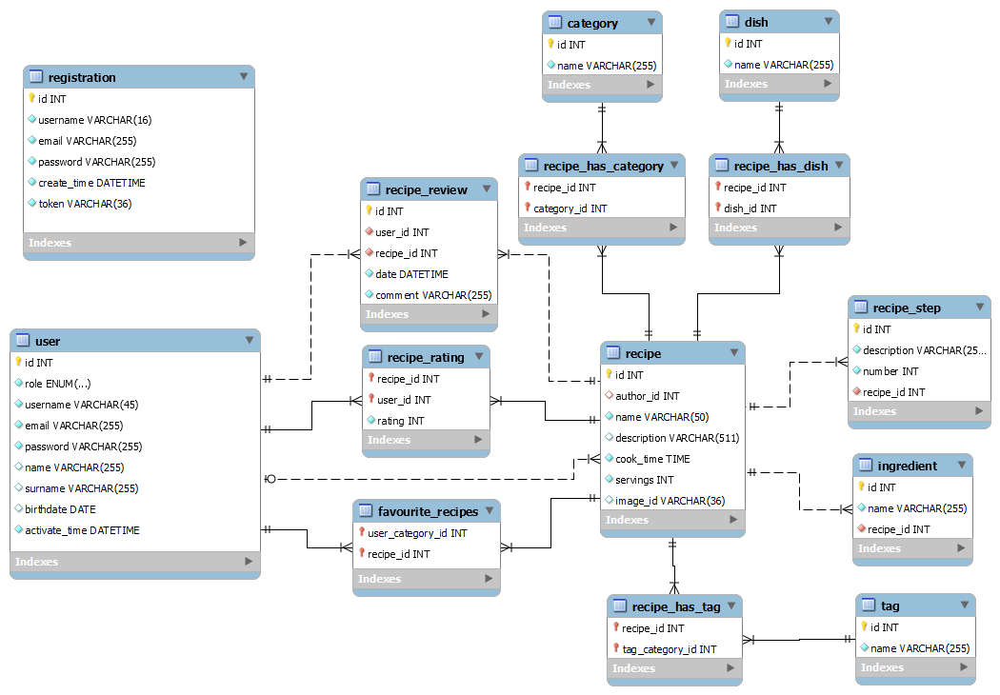

# TIN PROJEKT ZALICZENIOWY

Jest to projekt zaliczeniowy z przedmiotu TIN.

## Opis projektu

Projekt przedstawia zastosowanie technologii NodeJS z użyciem frameworka ExpressJS wraz z aplikacją typu SPA z użyciem
ReactJS. Wykorzystywana jest basa MySQL.

Aplikacja przedstawia przykład strony internetowej do przeglądania i dodwania przepisów kulinarnych.

## Uruchomienie projektu

Prerekwizyty do uruchomienia projektu:

- NodeJS (21+)
- Docker
- NPM

### Uruchomienie z poziomu Dockera

Aby uruchomić projekt z poziomu Dockera należy wykonać następujące kroki:

1. Zbudowanie zależności frontendu
```bash
npm run prepare
```

2. Zbudowanie obrazu Dockera
```bash
npm run build-docker
```

3. Uruchomienie kontenerów Dockera
```bash
npm run start-docker
```

Do uruchomienia należy dodać również plik `.env` w folderze `server` z następującą zawartością:

```dotenv
MYSQL_HOST= # adres hosta bazy danych
MYSQL_PORT= # port bazy danych
MYSQL_USER= # użytkownik bazy danych
MYSQL_PASSWORD= # hasło użytkownika bazy danych
MYSQL_DATABASE= # nazwa bazy danych
MYSQL_ROOT_PASSWORD= # hasło roota bazy danych
SERVER_PORT= # port backendu
APP_URL= # adres backendu
CLIENT_URL= # adres frontendu
DATABASE_URL=mysql://${MYSQL_USER}:${MYSQL_PASSWORD}@${MYSQL_HOST}:${MYSQL_PORT}/${MYSQL_DATABASE}

EMAIL_USER= # adres email do wysyłania maili
EMAIL_PASS= # hasło email do wysyłania maili
EMAIL_HOST= # adres hosta email
EMAIL_PORT= # port hosta email

ACCESS_TOKEN_SECRET= # sekret JWT, wygenerować np. za pomocą crypto.randomBytes(64).toString('hex') <- nodejs
REFRESH_TOKEN_SECRET= # sekret JWT
```

Plik ten jest wykorzystywany przy użyciu docker compose, jak i w przypadku uruchomienia z poziomu NodeJS 
w środowisku developerskim.

Spowoduje to uruchomienie kontenerów Dockera z aplikacją backendową oraz bazą danych MySQL.

### Uruchomienie z poziomu NodeJS

Moduł `server` posiada konfigurację `start` oraz `dev` umożliwiające na uruchomienie aplikacji backendowej.
Niezbędne do tego jest jednakże przebudowanie frontendu za pomocą komendy `npm run prepare`, co powoduje zbudowanie
aplikacji frontendowej i umieszczenie jej w folderze `server/public`, skąd serwer ExpressJS będzie ją serwował statycznie.

### Uruchomienie z poziomu Webstorm

W przypadku uruchomienia z poziomu webstorm należy wykonać komendę `npm run prepare` oraz `npm run dev` w folderze `server`.
Aby uruchomić środowisko deweloperskie frontendu należy wykonać komendę `npm run start` w folderze `client`.

## Struktura projektu

Projekt składa się z dwóch modułów:

- `server` - backend(nodejs, expressjs),
- `client` - frontend (react).

## Baza danych

### Schemat bazy danych



### Setup bazy danych

W projekcie korzystam z bazy danych MySQL. W projekcie wykorzystywany jest ORM Prisma. Zapewnia on automatyczne
generowanie schematu bazy danych na podstawie modeli oraz migracje.

Projektując bazę danych skorzystałem z MySQL Workbench. Następnie na podstawie utworzonego schematu wygenerowałem SQL.
Jest to plik `init.sql`. Uruchomiłem ten plik na czystej bazie MySQL. Następnie wygenerowałem modele prismy przy użyciu
komendy `npx prisma db pull`. W ten sposób wygenerowałem modele prisma na podstawie istniejącej bazy danych.
Aby wygenerować customowego clienta na podstawie modeli prisma należy wykonać komendę `npx prisma generate`.
Aby zainicjować czystą bazę danych należy wykonać komendę `npx prisma db push`, a następnie `npx prisma db seed`,
co zasili bazę danyhc przykładowymi danymi.

Do uruchomienia bazy danych podczas developmentu można skorzystać z pliku compose.yml.
W tym celu należy wykonać komendę `docker-compose up -d db` w folderze `server` 
lub skorzystać z gotowych konfiguracji startowych Webstorm zapisanych w projekcie.